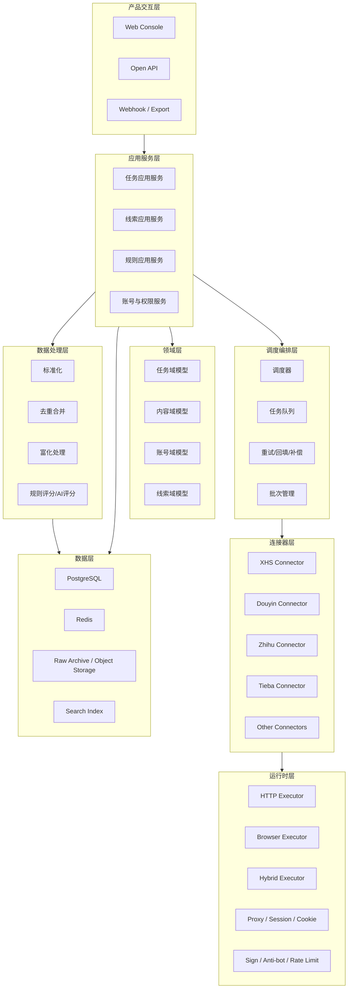

# MediaCrawler 专业数据抓取与线索管理平台重构方案

## 1. 文档目标

本文档用于指导当前 MediaCrawler 项目从“多平台爬虫工具”升级为“专业数据抓取平台 / 线索管理平台”。

改造目标不是简单增加平台数量，而是完成以下升级：

- 从单次运行脚本升级为可持续运行的平台化系统
- 从按平台分散的数据采集升级为统一的数据资产沉淀
- 从内容采集升级为线索识别、线索管理、线索流转
- 从本地命令行工具升级为面向团队协作的工作台

本文档重点覆盖：

- 产品定位
- 总体架构
- 核心领域模型
- 采集执行架构
- 任务调度体系
- 线索识别与评分体系
- Web 平台能力规划
- 数据库设计建议
- 分阶段实施路线
- 风险与治理建议

---

## 2. 当前项目现状评估

### 2.1 当前项目优势

当前 MediaCrawler 已经具备以下良好基础：

- 已覆盖多个主流内容平台
- 已形成按平台拆分的基础代码结构
- 已具备登录、Cookie、浏览器环境、代理池等能力
- 已具备多种数据落盘能力
- 已具备基础 WebUI
- 已具备一定的 CDP 反检测能力

### 2.2 当前项目主要问题

如果要演进为专业平台，当前存在以下限制：

- 代码中心仍是“平台爬虫”，不是“平台能力”
- 抓取流程和业务流程耦合较重
- 不同平台之间大量重复实现
- 数据模型以“帖子/评论”为主，缺少“线索”统一抽象
- 缺少任务中心、批次管理、失败重试、断点续跑
- 缺少统一的观测指标、告警、审计能力
- WebUI 更接近配置界面，不是业务工作台
- 数据存储偏导出型，不适合团队长期运营
- 浏览器能力没有彻底抽象成可插拔执行器

### 2.3 建议的新定位

建议将平台定位拆为两层：

#### 底层：数据抓取平台

负责：

- 数据源接入
- 登录与会话管理
- 采集调度
- 风控对抗
- 数据标准化
- 原始数据归档

#### 上层：线索管理平台

负责：

- 线索识别
- 去重合并
- 标签分类
- 优先级评分
- 跟进流转
- 协作分配
- 报表导出

这种分层的好处是：

- 采集能力可以复用到多个业务场景
- 线索能力不会和平台协议、签名、浏览器细节混在一起
- 后续接入新平台时不需要改动核心业务模型

---

## 3. 总体目标与非目标

### 3.1 总体目标

项目升级后的平台应满足以下目标：

1. 能够稳定接入多个公开数据源
2. 能够按规则持续、增量、可重试地采集数据
3. 能够将不同平台数据统一标准化
4. 能够基于规则和 AI 自动识别线索
5. 能够支持团队在 Web 工作台中查看、筛选、分配、跟进线索
6. 能够形成完整的数据审计、任务审计、操作审计链路

### 3.2 非目标

为避免项目失控，建议暂不把以下内容作为第一阶段目标：

- 一开始就支持几十个平台
- 一开始就完全去掉浏览器依赖
- 一开始就做复杂 CRM 全量能力
- 一开始就做多租户 SaaS 商业化交付
- 一开始就做大规模分布式集群

第一阶段应优先完成“平台化骨架”和“线索闭环”。

---

## 4. 新系统总体架构

### 4.1 分层架构

建议重构为以下 8 层架构：



### 4.2 分层职责说明

#### 产品交互层

负责：

- Web 后台
- API 接口
- 导出与通知
- 团队协作入口

#### 应用服务层

负责：

- 组装领域对象
- 编排任务与业务动作
- 向前端提供稳定接口
- 隔离基础设施实现细节

#### 领域层

负责：

- 线索、内容、账号、任务等核心业务模型
- 业务状态机
- 业务规则约束

#### 数据处理层

负责：

- 原始数据标准化
- 去重
- 实体合并
- 规则打标
- AI 分类与评分

#### 调度编排层

负责：

- 定时采集
- 批次执行
- 断点续跑
- 失败重试
- 优先级队列

#### 连接器层

负责：

- 各平台登录
- 搜索
- 详情
- 评论
- 作者主页
- 平台字段提取

#### 运行时层

负责：

- HTTP 请求
- 浏览器控制
- 会话管理
- 限流控制
- 代理策略
- 签名和反风控能力

#### 数据层

负责：

- 原始数据存档
- 标准化数据存储
- 检索索引
- 缓存与队列状态

---

## 5. 目录结构重构建议

建议在保留现有平台代码的基础上，逐步迁移为如下目录：

```text
MediaCrawler/
  apps/
    api/
    worker/
    scheduler/
    web/
  domain/
    content/
    actor/
    lead/
    task/
    rule/
  application/
    services/
    commands/
    queries/
    dto/
  connectors/
    base/
    xhs/
    douyin/
    zhihu/
    tieba/
    kuaishou/
    bilibili/
    weibo/
  runtime/
    browser/
    http/
    session/
    proxy/
    signing/
    anti_bot/
  pipeline/
    normalize/
    dedup/
    enrich/
    scoring/
  infrastructure/
    db/
    cache/
    queue/
    storage/
    observability/
    auth/
  schemas/
    raw/
    normalized/
    api/
  docs/
  tests/
    unit/
    integration/
    e2e/
  migrations/
```

### 5.1 迁移原则

- 不建议一次性平移所有旧目录
- 先新增新架构目录，再逐步把能力迁入
- 旧平台代码可短期作为 legacy connector 保留
- 每迁完一个平台，补一组契约测试

---

## 6. 核心领域模型设计

### 6.1 为什么要重做领域模型

当前项目主要围绕：

- 笔记
- 视频
- 评论
- 创作者

这适合采集，不适合运营。平台化后必须让业务主线变成“线索”。

### 6.2 核心实体

建议至少定义以下实体。

#### 1. SourcePlatform

表示平台来源。

关键字段：

- `platform_code`
- `platform_name`
- `status`
- `capabilities`

#### 2. CrawlSource

表示某次采集配置来源。

示例：

- 某关键词任务
- 某创作者主页任务
- 某指定 URL 列表

关键字段：

- `source_type`
- `platform_code`
- `query_config`
- `owner_id`

#### 3. CrawlTask

表示一条任务定义。

关键字段：

- `task_type`
- `schedule_type`
- `priority`
- `status`
- `retry_policy`
- `enabled`

#### 4. CrawlJob

表示任务的一次实际执行。

关键字段：

- `task_id`
- `batch_id`
- `status`
- `started_at`
- `ended_at`
- `error_code`
- `error_message`
- `metrics_snapshot`

#### 5. RawRecord

原始数据记录，必须长期保存。

关键字段：

- `platform_code`
- `record_type`
- `source_uri`
- `request_meta`
- `response_body`
- `fetched_at`
- `hash`

#### 6. Content

标准化内容实体。

统一承载：

- 小红书笔记
- 抖音视频
- 微博内容
- 知乎回答/文章
- 贴吧帖子

关键字段：

- `content_id`
- `platform_content_id`
- `platform_code`
- `content_type`
- `title`
- `body_text`
- `body_html`
- `publish_time`
- `author_id`
- `url`
- `engagement_metrics`

#### 7. Comment

标准化评论实体。

关键字段：

- `comment_id`
- `content_id`
- `parent_comment_id`
- `author_id`
- `text`
- `publish_time`

#### 8. Actor

统一账号实体。

关键字段：

- `actor_id`
- `platform_actor_id`
- `platform_code`
- `nickname`
- `profile_url`
- `bio`
- `location`
- `followers_count`

#### 9. Lead

线索主实体，是业务的中心。

关键字段：

- `lead_id`
- `lead_type`
- `status`
- `source_channel`
- `summary`
- `priority`
- `score`
- `owner_user_id`
- `first_seen_at`
- `last_seen_at`

#### 10. LeadEvidence

线索判断证据。

关键字段：

- `lead_id`
- `content_id`
- `comment_id`
- `matched_rule_id`
- `evidence_text`
- `confidence`

#### 11. LeadTag

线索标签。

示例：

- 装修需求
- 招聘中
- 找代运营
- 高活跃
- 电商卖家

#### 12. LeadActivity

线索流转记录。

关键字段：

- `lead_id`
- `activity_type`
- `operator_id`
- `before_status`
- `after_status`
- `note`
- `created_at`

#### 13. RuleSet / Rule

线索识别规则配置。

关键字段：

- `rule_type`
- `scope`
- `expression`
- `weight`
- `enabled`

---

## 7. 线索管理业务模型

### 7.1 线索生命周期

建议定义统一的线索状态机：

```text
NEW -> QUALIFIED -> ASSIGNED -> CONTACTING -> FOLLOWING -> WON / LOST / ARCHIVED
```

状态建议说明：

- `NEW`：新识别出的线索，尚未人工确认
- `QUALIFIED`：通过规则或人工确认有效
- `ASSIGNED`：已分配给负责人
- `CONTACTING`：已开始触达
- `FOLLOWING`：正在持续跟进
- `WON`：转化成功
- `LOST`：判定无效或流失
- `ARCHIVED`：归档

### 7.2 线索类型建议

可先定义一组通用类型：

- `purchase_intent`
- `service_demand`
- `recruitment_need`
- `channel_cooperation`
- `creator_outreach`
- `merchant_discovery`
- `brand_monitoring`

### 7.3 线索去重策略

线索平台一定要支持多层级去重：

#### 内容级去重

同平台同内容 ID 去重。

#### 账号级去重

同平台同账号 ID 去重。

#### 线索级去重

通过以下组合判断：

- 平台账号相同
- 联系方式相同
- 标题或文本高度相似
- 同类需求在短时间内重复出现

建议采用：

- 硬规则去重
- 文本相似度去重
- 人工合并

---

## 8. Connector 插件化改造方案

### 8.1 目标

把当前按平台复制的 `core/client/login` 结构，重构为统一 connector 协议。

### 8.2 Connector 接口建议

```python
class BaseConnector(ABC):
    platform_code: str

    async def authenticate(self, context: AuthContext) -> AuthResult:
        ...

    async def health_check(self) -> HealthStatus:
        ...

    async def search(self, query: SearchQuery) -> SearchResult:
        ...

    async def fetch_content_detail(self, content_id: str, extra: dict | None = None) -> ContentDetail:
        ...

    async def fetch_comments(self, content_id: str, cursor: str | None = None) -> CommentPage:
        ...

    async def fetch_actor(self, actor_id: str) -> ActorProfile:
        ...

    async def normalize(self, raw: dict) -> NormalizedEntity:
        ...
```

### 8.3 Connector 能力声明

不同平台能力不同，建议通过 metadata 声明：

- 是否支持搜索
- 是否支持详情
- 是否支持评论
- 是否支持作者主页
- 是否必须浏览器
- 是否必须签名
- 是否支持断点续跑
- 是否支持增量时间窗口

### 8.4 执行器分离

每个 connector 不直接依赖 Playwright 或 httpx，而是依赖抽象执行器：

- `HttpExecutor`
- `BrowserExecutor`
- `HybridExecutor`

这样未来可以灵活切换。

---

## 9. 运行时能力重构建议

### 9.1 Browser Runtime

负责：

- CDP 浏览器管理
- Playwright 浏览器上下文管理
- 指纹控制
- Cookie 注入与持久化
- 页面预热
- JS 注入

### 9.2 HTTP Runtime

负责：

- 统一请求封装
- 连接池
- 限速
- 超时与重试
- SSL 策略
- 代理切换
- request / response 审计

### 9.3 Session Runtime

负责：

- 登录态存储
- Cookie 生命周期
- Token 刷新
- 多账号管理

### 9.4 Signing Runtime

负责：

- 小红书签名
- 抖音参数签名
- 知乎请求签名
- 平台差异化 header 构造

### 9.5 Anti-Bot Runtime

负责：

- 限流控制
- IP 熔断
- 风控命中记录
- 验证码事件记录
- 退避策略

---

## 10. 任务调度与执行系统设计

### 10.1 为什么必须引入任务系统

专业平台必须摆脱“命令行执行一次”的模型，改为任务驱动。

### 10.2 任务类型建议

- `search_crawl`
- `detail_crawl`
- `creator_crawl`
- `comment_backfill`
- `lead_recheck`
- `rule_recompute`
- `data_export`

### 10.3 调度模式

支持三种模式：

#### 手动触发

适合临时搜索与验证。

#### 定时调度

适合每天监控关键词和账号。

#### 事件触发

适合：

- 某任务完成后自动补评论
- 某线索打上高意向标签后触发通知

### 10.4 Job 状态建议

- `pending`
- `queued`
- `running`
- `success`
- `partial_success`
- `failed`
- `retrying`
- `cancelled`

### 10.5 Job 统计建议

每次执行应采集：

- 抓取内容数
- 抓取评论数
- 原始响应数
- 去重后内容数
- 新增线索数
- 高价值线索数
- 失败请求数
- 风控命中数
- 平均耗时

### 10.6 队列建议

第一阶段可采用：

- PostgreSQL 任务表
- Redis 队列
- Worker 轮询 / 消费

后续可扩展为：

- Celery / RQ / Dramatiq
- 或自研轻量任务分发器

### 10.7 断点续跑

建议每类任务都持久化 cursor：

- 页码
- 时间窗口
- 最后成功内容 ID
- 评论 cursor
- 作者主页 cursor

---

## 11. 数据处理 Pipeline 设计

### 11.1 数据处理阶段

建议每条数据进入以下 pipeline：

1. 原始入库
2. 基础校验
3. 平台字段标准化
4. 富文本清洗
5. 实体抽取
6. 去重判断
7. 线索判定
8. 标签打标
9. 评分
10. 入业务库

### 11.2 标准化输出

各平台 connector 最终都输出统一结构：

- `normalized_content`
- `normalized_comments`
- `normalized_actor`
- `lead_candidates`

### 11.3 富化能力

建议支持：

- 地域识别
- 联系方式抽取
- 行业识别
- 情绪判断
- 商品/服务关键词提取
- 发布时间归一

---

## 12. 规则引擎与 AI 识别方案

### 12.1 为什么规则引擎是核心

抓取得到的是“信息”，不是“线索”。

线索平台的价值来自把海量信息转成可行动对象。

### 12.2 规则类型建议

#### 关键词规则

示例：

- 包含“求推荐”
- 包含“有没有做”
- 包含“哪里找”
- 包含“招聘”
- 包含“合作”

#### 组合规则

示例：

- 有联系方式且提到采购意图
- 标题含需求词且评论数大于阈值
- 近 7 天重复发布相似诉求

#### 排除规则

示例：

- 广告号
- 搬运号
- 内容过短
- 明显无业务价值的噪声

#### AI 规则

使用模型判断：

- 是否存在明确需求
- 需求属于什么行业
- 意向强弱
- 是否值得销售跟进

### 12.3 评分模型建议

可先使用简单加权模型：

```text
LeadScore =
  关键词命中分 +
  行为活跃分 +
  账号画像分 +
  联系方式置信分 +
  AI意向分 -
  噪声惩罚分
```

### 12.4 输出结果

规则引擎输出建议包括：

- 是否命中线索
- 命中哪些规则
- 线索类型
- 置信度
- 优先级
- 推荐下一步动作

---

## 13. 数据库设计建议

### 13.1 存储选型

建议采用：

- `PostgreSQL`：主业务库
- `Redis`：缓存、队列、去重键
- `对象存储/本地归档`：原始 JSON、HTML、截图
- `OpenSearch/Elasticsearch`：全文检索，可第二阶段引入

### 13.2 核心表建议

第一阶段建议建立以下核心表：

- `platforms`
- `crawl_sources`
- `crawl_tasks`
- `crawl_jobs`
- `raw_records`
- `contents`
- `comments`
- `actors`
- `lead_candidates`
- `leads`
- `lead_evidences`
- `lead_tags`
- `lead_activities`
- `rule_sets`
- `rules`
- `user_accounts`
- `crawler_accounts`
- `proxy_resources`

### 13.3 设计原则

- 原始记录不可覆盖
- 标准化实体允许更新
- 线索状态变更必须留痕
- 任务执行必须有审计
- 所有关键表都应带 `created_at / updated_at`

---

## 14. Web 平台产品能力规划

### 14.1 Web 平台目标

Web 平台不应只是“启动爬虫”的地方，而应成为运营工作台。

### 14.2 页面规划

建议至少包括以下页面：

#### 1. 仪表盘

展示：

- 今日采集量
- 今日新增线索
- 高价值线索数
- 各平台成功率
- 风控情况

#### 2. 任务中心

展示：

- 任务列表
- 调度状态
- 最近执行记录
- 失败原因
- 重试按钮

#### 3. 数据源管理

配置：

- 平台
- 关键词
- 作者主页
- URL 列表
- 时间窗口

#### 4. 线索池

支持：

- 筛选
- 排序
- 标签过滤
- 状态过滤
- 批量分配
- 批量导出

#### 5. 线索详情页

建议展示：

- 线索摘要
- 命中证据
- 原始内容
- 作者画像
- 历史相关内容
- 跟进记录
- 推荐动作

#### 6. 规则中心

支持：

- 新增规则
- 测试规则
- 启停规则
- 查看规则命中效果

#### 7. 平台运行页

展示：

- 登录账号状态
- Cookie 有效性
- 代理健康
- 浏览器实例状态
- 风控事件

#### 8. 导出与集成页

支持：

- CSV / Excel 导出
- Webhook 推送
- API Token
- 第三方 CRM 对接

### 14.3 权限模型

第一阶段建议支持基本角色：

- `admin`
- `operator`
- `sales`
- `viewer`

---

## 15. 可观测性与运维治理

### 15.1 指标体系

建议建立以下指标：

#### 平台指标

- 平台请求成功率
- 平台接口失败率
- 风控命中率
- 验证码触发次数

#### 任务指标

- 任务执行时长
- 任务成功率
- 任务重试次数
- 队列积压长度

#### 数据指标

- 原始记录数
- 标准化成功率
- 去重率
- 新增线索数
- 高意向线索占比

### 15.2 日志体系

建议拆分为：

- 应用日志
- 任务日志
- 请求日志
- 风控事件日志
- 审计日志

### 15.3 告警建议

建议触发告警的场景：

- 某平台连续失败
- 某账号登录失效
- 风控命中率突增
- 任务积压严重
- 数据入库失败

---

## 16. 安全、合规与治理建议

### 16.1 安全建议

- 敏感 Cookie 加密存储
- 平台账号密码不明文落库
- 操作审计可追踪
- 接口鉴权和角色控制
- 导出行为留痕

### 16.2 合规建议

- 明确用途边界，仅采集公开信息
- 控制采集频率，避免对平台造成冲击
- 记录数据来源和时间
- 允许后续执行数据清理与归档

### 16.3 平台治理建议

- 建立 connector 准入规范
- 新平台必须附带测试和指标
- 风控事件必须可回溯
- 禁止直接在业务层书写平台特定逻辑

---

## 17. 技术栈建议

### 17.1 后端

- Python 3.11+
- FastAPI
- SQLAlchemy 2.x
- Pydantic
- Alembic
- Redis
- PostgreSQL

### 17.2 异步与任务

- asyncio
- Redis Queue / Celery / Dramatiq 三选一
- APScheduler 或独立 scheduler 服务

### 17.3 前端

建议保留现有 React 基础，逐步升级为：

- React
- Vite
- TanStack Query
- React Router
- 图表库
- 表格与筛选组件

### 17.4 可观测性

- structlog / loguru 二选一统一日志
- Prometheus + Grafana
- Sentry

---

## 18. 分阶段实施路线

### Phase 0：准备期

目标：

- 明确产品定位
- 冻结旧结构继续扩散
- 制定迁移边界

输出：

- 本文档
- 技术选型清单
- 重构里程碑

### Phase 1：平台骨架重建

目标：

- 建立新目录结构
- 建立 PostgreSQL 业务库
- 引入任务模型、Job 模型、RawRecord 模型
- 建立 connector 抽象接口

输出：

- 新骨架工程可运行
- 旧项目可兼容调用

### Phase 2：接入 1 到 2 个标杆平台

建议优先：

- `zhihu`
- `tieba`

原因：

- 结构相对清晰
- 更适合先打通标准化和线索链路

输出：

- Connector 插件化
- 标准化内容入库
- 原始数据归档

### Phase 3：任务调度与断点续跑

目标：

- 定时任务
- 批次任务
- 重试补偿
- 任务监控

输出：

- Worker 与 Scheduler
- 任务中心页面

### Phase 4：线索引擎上线

目标：

- lead candidate 生成
- 规则打标
- 去重合并
- 评分排序

输出：

- 线索池
- 线索详情页
- 规则中心

### Phase 5：补充强风控平台

建议后续再逐步迁移：

- 小红书
- 抖音
- 快手
- 微博

目标：

- 把浏览器、签名、混合执行器真正抽象干净

### Phase 6：产品化完善

目标：

- 权限
- 导出
- 通知
- 第三方 CRM 对接
- 完整监控告警

---

## 19. 近期最值得优先落地的 10 个动作

1. 建立新目录骨架，不再往旧结构追加复杂逻辑
2. 引入 PostgreSQL 和 Alembic，建立基础业务表
3. 新建 `BaseConnector` 协议
4. 新建 `RawRecord` 与 `Content` 标准模型
5. 新建 `CrawlTask` 和 `CrawlJob` 执行模型
6. 先把知乎或贴吧迁入新 connector
7. 建立统一的日志与指标结构
8. 在 WebUI 中增加任务中心和执行记录页
9. 新建 `Lead`、`LeadEvidence`、`Rule` 三类表
10. 上线第一版线索识别规则引擎

---

## 20. 风险评估与应对策略

### 20.1 风险：一次性重写过多

应对：

- 采用分阶段迁移
- 旧平台代码保留为 legacy 实现

### 20.2 风险：平台风控导致改造期不稳定

应对：

- 优先改造低风控平台
- 浏览器 executor 和 HTTP executor 并行保留

### 20.3 风险：线索模型设计过早过重

应对：

- 第一阶段先保留轻量字段
- 后续通过迁移扩展

### 20.4 风险：前后端同步推进导致节奏混乱

应对：

- 先做后端标准模型和任务 API
- 前端按模块逐步接入

---

## 21. 最终建议

如果项目目标是“专业化”，真正的关键不是再增加多少采集平台，而是完成以下三件事：

1. 把采集逻辑抽象成平台能力，而不是脚本实现
2. 把数据中心从帖子评论升级为线索实体
3. 把使用方式从命令行执行升级为任务化、平台化、团队化

建议以“底层数据抓取平台 + 上层线索管理平台”的双层结构推进，先打通：

- Connector 抽象
- 任务系统
- 标准化数据模型
- Lead 模型
- Web 工作台

打通这五项后，项目会从“好用的爬虫项目”变成“有产品潜力的数据平台”。

---

## 22. 附录：建议的第一阶段交付定义

第一阶段完成标准建议如下：

- 能通过 Web 创建一个关键词采集任务
- 能调度 worker 执行任务
- 能将原始响应入库或归档
- 能产出标准化 `Content` / `Actor` / `Comment`
- 能基于规则生成 `LeadCandidate`
- 能在 Web 查看任务结果和线索池

如果上述能力可以闭环，说明项目已经完成从“爬虫工具”到“平台原型”的第一次跃迁。
