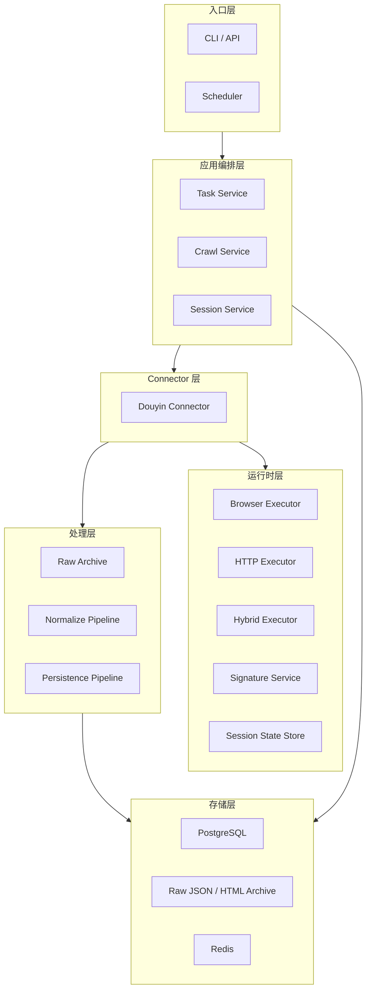

# MediaCrawler 数据采集平台优先实施方案（抖音先迁移）

## 1. 文档目的

本文档用于指导 MediaCrawler 的下一阶段重构工作，明确采用“先把数据采集平台做专业，再逐步承接线索管理”的实施路径。

本方案与总方案文档的区别在于：

- 本文档只聚焦数据采集平台
- 本文档优先围绕抖音平台迁移展开
- 本文档强调可执行步骤，而不是完整产品全景

目标是把当前项目从“按平台运行的爬虫程序”升级为“可持续运行、可调度、可追踪、可扩展的数据采集平台”。

---

## 2. 当前阶段的正确目标

### 2.1 建议目标

当前阶段建议收敛为一句话：

**把 MediaCrawler 重构成一个专业的数据采集平台，并优先完成抖音 Connector 的样板迁移。**

### 2.2 为什么先不做完整线索平台

如果底层采集不稳定，线索层会出现以下问题：

- 数据源断断续续，线索池质量不稳定
- 失败不可回溯，线索生成结果不可解释
- 采集字段不统一，业务模型不断返工
- 风控、代理、Cookie、签名问题会反复穿透到上层

因此当前阶段最重要的是先完成以下底座能力：

- Connector 抽象
- 执行器抽象
- 任务调度
- 原始数据归档
- 标准化数据模型
- 可观测性

---

## 3. 为什么优先迁移抖音

### 3.1 抖音的代表性很强

抖音平台当前实现兼具以下特点：

- 依赖浏览器环境
- 依赖本地 `localStorage`
- 依赖动态参数和签名逻辑
- 既有搜索，又有详情、评论、创作者主页
- 既有浏览器登录，又有 HTTP 抓取

这意味着：

- 如果抖音能迁移成功，后续小红书、快手、微博的抽象难度会显著下降
- 如果先迁移知乎、贴吧，虽然更简单，但对高风控平台的抽象验证不足

### 3.2 当前抖音实现的关键耦合点

从现有代码看，抖音当前结构如下：

- `DouYinCrawler` 负责启动浏览器、登录、搜索、详情、评论、创作者抓取
- `DouYinClient` 同时依赖 `httpx` 与 `playwright_page`
- `DouYinLogin` 负责二维码、手机号、Cookie 登录
- 参数计算依赖浏览器页面环境中的 `localStorage` 和 `a_bogus`

关键事实：

- `msToken` 来自页面 `localStorage.xmst`
- `a_bogus` 由 `get_a_bogus(..., self.playwright_page)` 生成
- 登录成功判断依赖浏览器 Cookie 和 `localStorage.HasUserLogin`

因此抖音迁移不能直接从“HTTP 客户端重写”开始，而应先抽象：

- 会话层
- 浏览器执行层
- 参数签名层
- 请求构造层

---

## 4. 抖音当前架构问题分析

### 4.1 当前 `DouYinCrawler` 的职责过重

当前 `media_platform/douyin/core.py` 同时承担了：

- 浏览器生命周期管理
- 登录态检查
- 平台任务分发
- 搜索翻页控制
- 评论抓取编排
- 存储调用
- 代理逻辑传递

问题在于：

- 业务流程与基础设施耦合
- 无法方便接入统一任务中心
- 无法单独测试搜索、详情、评论能力
- 后续多平台迁移会继续复制同样结构

### 4.2 当前 `DouYinClient` 的职责边界不清晰

`DouYinClient` 目前同时承担了：

- 请求发送
- 参数拼装
- 浏览器页面读取
- Cookie 更新
- 业务接口封装
- 评论翻页与回调

这会导致：

- client 变成“半业务对象”
- 后续不能轻松切换 HTTP executor 或 Browser executor
- 测试时必须带浏览器依赖，难以隔离

### 4.3 当前登录与运行态没有统一 Session 抽象

现在登录逻辑散落在：

- `DouYinLogin`
- `DouYinCrawler.start`
- `DouYinClient.update_cookies`

但缺少统一的：

- SessionState
- CookieStore
- BrowserState
- AuthResult

这会让后续做任务恢复、持久化登录态、失败补偿时很痛苦。

---

## 5. 第一阶段重构目标

### 5.1 目标边界

本阶段只做采集平台，不做完整线索管理。

### 5.2 本阶段必须交付的能力

1. 建立新的采集平台骨架
2. 建立统一 Connector 接口
3. 建立统一 Executor 接口
4. 建立统一 Session 模型
5. 建立任务和运行记录模型
6. 完成抖音 Connector 样板迁移
7. 新旧实现可以并存一段时间

### 5.3 本阶段不追求的内容

- 不要求所有平台同时迁移
- 不要求彻底移除 Playwright
- 不要求第一阶段上线复杂 Web 工作台
- 不要求第一阶段上线 AI 线索识别

---

## 6. 第一阶段目标架构



---

## 7. 新模块设计

### 7.1 Connector 抽象

建议新建：

- `connectors/base/base_connector.py`
- `connectors/douyin/connector.py`

建议接口：

```python
class BaseConnector(ABC):
    platform_code: str

    async def prepare(self, context: "ConnectorContext") -> None:
        ...

    async def authenticate(self, auth_context: "AuthContext") -> "AuthResult":
        ...

    async def health_check(self) -> "HealthStatus":
        ...

    async def search(self, query: "SearchQuery") -> "SearchPage":
        ...

    async def fetch_content_detail(self, content_id: str, extra: dict | None = None) -> dict:
        ...

    async def fetch_comments(self, content_id: str, cursor: str | int | None = None) -> dict:
        ...

    async def fetch_creator(self, creator_id: str) -> dict:
        ...

    async def fetch_creator_contents(self, creator_id: str, cursor: str | None = None) -> dict:
        ...

    async def close(self) -> None:
        ...
```

### 7.2 Executor 抽象

建议新建：

- `runtime/http/executor.py`
- `runtime/browser/executor.py`
- `runtime/hybrid/executor.py`

职责如下。

#### `HttpExecutor`

负责：

- 发送请求
- 重试
- 超时
- 代理
- trace id
- request/response logging

#### `BrowserExecutor`

负责：

- 浏览器启动与关闭
- CDP / Playwright 模式
- page/context 生命周期
- 执行页面脚本
- 读取 localStorage / cookies / userAgent

#### `HybridExecutor`

负责：

- 从浏览器态读取签名所需状态
- 由 HTTP executor 实际发请求
- 支持“浏览器预热 + HTTP 跑批量接口”

抖音非常适合使用 `HybridExecutor`。

### 7.3 Session 模块

建议新建：

- `runtime/session/models.py`
- `runtime/session/store.py`
- `runtime/session/service.py`

核心模型建议：

- `SessionState`
- `CookieState`
- `LocalStorageState`
- `BrowserFingerprint`
- `AuthResult`

建议 `SessionState` 统一保存：

- cookies
- local_storage_snapshot
- user_agent
- login_status
- last_validated_at
- platform_code
- account_id

### 7.4 Signature 模块

建议新建：

- `runtime/signing/douyin_signer.py`

核心职责：

- 从 session 中取 `msToken`
- 基于 query/body 和 `User-Agent` 计算 `a_bogus`
- 将平台动态参数构建过程从 client 中拆出去

---

## 8. 抖音 Connector 的新职责划分

### 8.1 新 `DouyinConnector` 应该负责什么

负责：

- 定义抖音平台能力
- 调用 session service 做登录检查
- 调用 signer 计算参数
- 调用 hybrid executor 请求接口
- 返回原始结果和标准化结果

### 8.2 新 `DouyinConnector` 不应该负责什么

不负责：

- 任务调度
- 批次分页总控
- 存储实现细节
- 统一日志框架
- 统一代理池策略
- WebUI 逻辑

### 8.3 推荐的 Douyin 模块拆分

建议新增如下结构：

```text
connectors/
  douyin/
    connector.py
    auth.py
    search.py
    detail.py
    comment.py
    creator.py
    normalizer.py
    mapper.py
    schemas.py
```

分工建议：

- `auth.py`：登录与登录校验
- `search.py`：搜索相关 API
- `detail.py`：作品详情
- `comment.py`：评论翻页
- `creator.py`：创作者主页与作品列表
- `normalizer.py`：标准化输出
- `mapper.py`：字段映射与兼容旧字段

---

## 9. 抖音迁移策略

### 9.1 不建议直接覆盖旧实现

建议采用：

- 旧版 `media_platform/douyin/*` 保留
- 新版迁移到 `connectors/douyin/*`
- 通过配置切换使用旧版或新版

例如增加：

- `CRAWLER_RUNTIME_MODE = "legacy" | "platform"`

### 9.2 建议的迁移顺序

#### Step 1：先抽 Session 和 Executor

原因：

- 抖音参数强依赖浏览器态
- 直接改 search/detail/comment 只会把耦合复制到新目录

#### Step 2：迁移搜索能力

优先实现：

- `search_info_by_keyword`

因为搜索是抖音平台最常用入口，也是后续 detail/comment 的种子来源。

#### Step 3：迁移详情能力

实现：

- `get_video_by_id`
- 短链解析

#### Step 4：迁移评论能力

实现：

- 一级评论
- 二级评论
- 最大评论数控制
- cursor 持久化结构

#### Step 5：迁移创作者能力

实现：

- 用户资料
- 用户作品列表

#### Step 6：迁移登录校验和 session 持久化

最终实现平台化闭环。

---

## 10. 数据模型建议

### 10.1 第一阶段最少需要的表

建议第一阶段先建立以下表：

- `crawl_tasks`
- `crawl_jobs`
- `crawl_job_events`
- `session_states`
- `raw_records`
- `contents`
- `comments`
- `actors`

### 10.2 表职责说明

#### `crawl_tasks`

保存任务定义，例如：

- 平台
- 关键词
- 类型
- 调度方式
- 状态

#### `crawl_jobs`

保存每次任务执行实例，例如：

- 任务 ID
- 批次 ID
- 运行状态
- 起止时间
- 错误信息

#### `crawl_job_events`

保存运行过程中的关键事件：

- 登录成功
- 请求失败
- 风控命中
- 重试
- 分页完成

#### `session_states`

保存平台会话态：

- cookies
- localStorage
- userAgent
- account_id
- validity

#### `raw_records`

保存原始请求结果：

- 平台
- 记录类型
- source_uri
- raw_body
- fetched_at

#### `contents`

保存标准化内容实体。

#### `comments`

保存标准化评论实体。

#### `actors`

保存标准化作者实体。

---

## 11. 任务系统设计

### 11.1 为什么第一阶段就要上任务模型

即使暂时不做复杂 UI，任务模型也必须先有，因为后续这些能力都依赖它：

- 定时采集
- 批次重试
- 断点续跑
- 平台运行日志
- 执行统计

### 11.2 抖音任务类型建议

第一阶段建议支持以下任务类型：

- `douyin_search`
- `douyin_detail`
- `douyin_comment_backfill`
- `douyin_creator`

### 11.3 任务输入模型

建议统一成：

```json
{
  "platform": "douyin",
  "task_type": "search",
  "params": {
    "keywords": ["装修", "餐饮加盟"],
    "publish_time": "0",
    "sort_type": "0",
    "page_limit": 3,
    "comment_limit": 20
  }
}
```

### 11.4 Job 输出模型

建议统一记录：

- 请求数
- 成功数
- 失败数
- 内容数
- 评论数
- 风控事件数
- 平均耗时

---

## 12. 抖音迁移的测试策略

### 12.1 必须建立的测试层次

#### 单元测试

测试：

- 参数构造
- query 拼装
- mapper
- normalizer
- session 状态解析

#### 集成测试

测试：

- search API
- detail API
- comment API
- creator API

#### 回归测试

测试：

- 新旧实现对同一输入的输出差异

### 12.2 回归比对建议

对以下能力做新旧比对：

- 搜索结果条数
- 详情字段完整度
- 评论抓取数量
- 创作者资料字段

---

## 13. 可观测性方案

### 13.1 日志结构建议

建议日志统一包含：

- `platform`
- `connector`
- `task_id`
- `job_id`
- `request_name`
- `content_id`
- `account_id`
- `proxy_id`
- `event_type`

### 13.2 抖音专项指标

建议增加：

- `douyin_login_success_rate`
- `douyin_search_success_rate`
- `douyin_detail_success_rate`
- `douyin_comment_success_rate`
- `douyin_risk_event_count`
- `douyin_a_bogus_failure_count`
- `douyin_session_invalid_count`

### 13.3 风控事件建议分类

- `captcha_detected`
- `login_invalid`
- `blocked_response`
- `signature_failed`
- `proxy_expired`
- `unexpected_redirect`

---

## 14. 第一阶段落地任务拆解

### Milestone 1：搭骨架

交付：

- 新增 `connectors/`
- 新增 `runtime/`
- 新增 `application/`
- 新增 `schemas/`
- 新增 `session` 模块

### Milestone 2：抽执行器

交付：

- `BrowserExecutor`
- `HttpExecutor`
- `HybridExecutor`
- 统一 executor interface

### Milestone 3：抽抖音会话与签名

交付：

- `DouyinSessionService`
- `DouyinSigner`
- `AuthResult`
- session persistence

### Milestone 4：迁移抖音搜索

交付：

- `DouyinConnector.search`
- 原始响应归档
- 标准化内容输出

### Milestone 5：迁移抖音详情与评论

交付：

- `fetch_content_detail`
- `fetch_comments`
- cursor state

### Milestone 6：迁移抖音创作者

交付：

- `fetch_creator`
- `fetch_creator_contents`

### Milestone 7：接入任务系统

交付：

- `crawl_tasks`
- `crawl_jobs`
- worker runner
- retry / status tracking

---

## 15. 第一阶段推荐的代码改造顺序

建议按下面顺序动手，尽量减少返工：

1. 新建目录与基础接口
2. 新建 session 模型与 executor 抽象
3. 把抖音参数构造逻辑从 `DouYinClient` 拆到 signer
4. 把浏览器状态读取逻辑从 `DouYinClient` 拆到 session service
5. 新建 `DouyinConnector.search`
6. 新建内容标准化与原始响应归档
7. 再迁移 detail/comment/creator
8. 最后接入任务中心

不建议一开始先改：

- 旧 `store` 全量逻辑
- 全部 WebUI
- 所有平台统一迁移

---

## 16. 风险与应对

### 风险 1：抖音迁移期间参数逻辑容易断

应对：

- 保留旧实现
- 做新旧双跑比对
- 对 `a_bogus` 计算单独留测试样例

### 风险 2：浏览器状态抽象过度，落地太慢

应对：

- 第一阶段只抽抖音需要的最小 session 字段
- 不强求一次把所有平台共性抽到极致

### 风险 3：任务系统先做太大

应对：

- 第一阶段只做单机 worker + PostgreSQL job 表
- 定时调度后置

---

## 17. 最终建议

如果当前只能选一个方向优先投入，我建议坚定优先做数据采集平台，而且抖音值得作为第一批高价值样板平台。

第一阶段最关键的，不是“把抖音代码搬到新目录”，而是通过抖音把以下四件事真正做出来：

1. Session 抽象
2. Executor 抽象
3. Connector 协议
4. Job / RawRecord / Content 的平台化数据链路

只要这四件事打通，后面迁移小红书、快手、微博时就不再是“复制旧代码”，而是真正开始构建一个专业的数据采集平台。

---

## 18. 建议的下一步动作

建议下一步直接进入工程实施，按顺序做：

1. 创建新目录骨架
2. 定义 `BaseConnector` 与 `BaseExecutor`
3. 定义 `SessionState`、`CrawlTask`、`CrawlJob`、`RawRecord`、`Content`
4. 从抖音开始抽离 signer 与 session service
5. 搭第一版 `DouyinConnector.search`

做到这一步，整个项目就会进入可持续重构状态。
